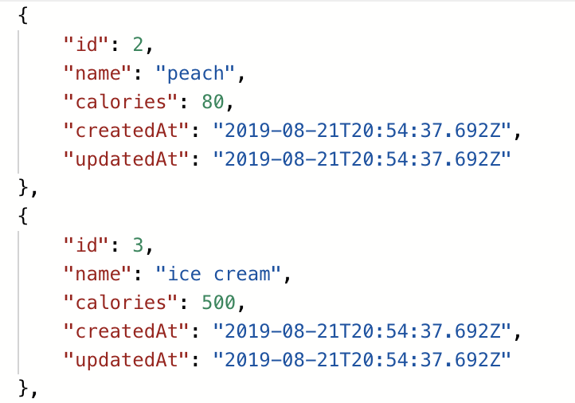
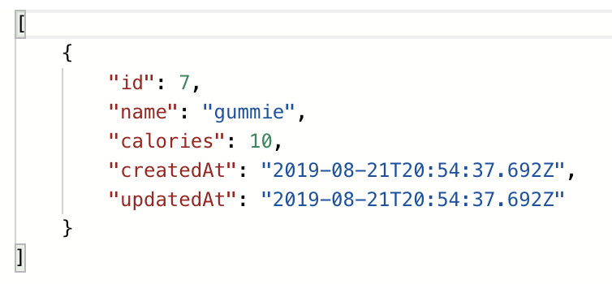
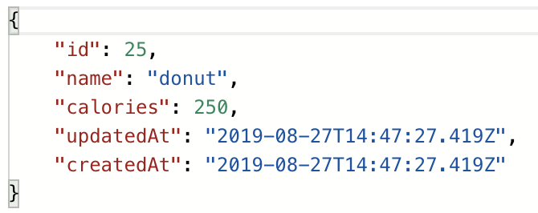

# Om-Nom

Om-Nom is a pair project for the Turing School of Software and Design's Backend Engineering program.  The project uses backend JavaScript technologies (NodeJS and Express) to build out a calorie tracker app. Learning goals for this project include:

* Create an Express API given specified endpoints
and response formats.
* Create a microservice that interfaces with the Edamam API.
* Integrate both apps together.

The Express API is located at:
https://omm-nomm.herokuapp.com/

The microservice, Om-Nom-Edamam (also written in Expresss) is located at:
https://om-nom-edamam.herokuapp.com/

## Usage

There are three main endpoints in the Om-Nom app: one each for foods, meals and recipes.  The foods endpoints lists foods that are in the database.  The meals endpoints lists the meals and the foods that are in them.  The recipes endpoints make API calls to the Om-Nom-Edamam service to gather recipe data for the type of food the user passes in.

### Foods Endpoints

The first endpoint returns all foods currently in the database.  The user makes a GET request to `api/v1/foods`.  The response is shown below.

The second endpoint returns a specific food currently in the database.  The user makes a GET request to `api/v1/foods/:id`.  If the food is not in the database, the app returns a 404 status code.  A successful response is shown below.

The third endpoint allows a user to create a food with the attributes of name and calories given in the body of the request.  The user makes a POST request to `api/v1/foods`.  A successful request will return the food that was just created.  If the food could not be created, the app returns a 400 status code.  A successful response is show below.

